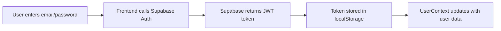
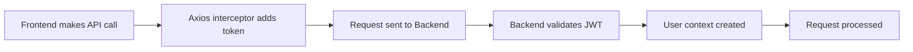

# Authentication Architecture & Troubleshooting Guide

## Overview
This document describes the authentication system for Sentigen Social, a platform with:
- **Frontend**: Next.js app deployed on Vercel
- **Backend**: FastAPI app deployed on Railway  
- **Auth Provider**: Supabase (email-based authentication only)
- **Database**: Supabase PostgreSQL

## Current Problem
Users can successfully authenticate on the frontend (visible by the "G" profile picture), but when they try to use backend features like the Research Pipeline, they get "sign in required" errors, indicating the backend is not recognizing the authenticated user.

## Architecture Components

### 1. Frontend (Vercel)
**URL**: https://zyyn.ai

**Key Files**:
- `/frontend/src/lib/supabase/client.ts` - Supabase client singleton
- `/frontend/src/contexts/user-context.tsx` - Global user state management
- `/frontend/src/lib/api.ts` - Axios client with auth token injection
- `/frontend/src/app/dashboard/create/pipeline/page.tsx` - Pipeline page making API calls

**Environment Variables**:
```
NEXT_PUBLIC_SUPABASE_URL=https://lvgrswaemwvmjdawsvdj.supabase.co
NEXT_PUBLIC_SUPABASE_ANON_KEY=eyJhbGciOiJIUzI1NiIsInR5cCI6IkpXVCJ9...
NEXT_PUBLIC_API_URL=https://sentigen-social-production.up.railway.app
```

### 2. Backend (Railway)
**URL**: https://sentigen-social-production.up.railway.app

**Key Files**:
- `/social-media-module/backend/core/user_auth.py` - JWT validation and user context
- `/social-media-module/backend/core/supabase_client.py` - Supabase service client
- `/social-media-module/backend/api/research_tools_api.py` - Research endpoints
- `/social-media-module/backend/api/main.py` - FastAPI app configuration

**Required Environment Variables**:
```
SUPABASE_URL=https://lvgrswaemwvmjdawsvdj.supabase.co
SUPABASE_SERVICE_KEY=eyJhbGciOiJIUzI1NiIsInR5cCI6IkpXVCJ9... (service role key)
SUPABASE_ANON_KEY=eyJhbGciOiJIUzI1NiIsInR5cCI6IkpXVCJ9... (anon key)
JWT_SECRET=AMo8kf6/8Q8tBgpl4gBjQNuTJslL6/YMaSnnUWwdTXVggoAxCxFJeiKH2r3m0O+95xYfR1p6Q4IWfSRrl64yyg==
```

### 3. Supabase Configuration
- **Project URL**: https://lvgrswaemwvmjdawsvdj.supabase.co
- **Auth Method**: Email/Password only (GitHub OAuth removed)
- **JWT Secret**: Legacy JWT Secret from Supabase dashboard (used to validate tokens)

## How Authentication Should Work

### 1. User Login Flow


### 2. API Request Flow


### 3. Token Validation Process (Backend)
```python
# In user_auth.py
1. Extract Bearer token from Authorization header
2. Decode JWT using Supabase JWT_SECRET
3. Extract user_id from 'sub' claim
4. Look up user in database
5. Create UserContext with permissions
6. Return authenticated user context
```

## What We've Implemented

### Frontend Changes

1. **Supabase Client Singleton** (`/frontend/src/lib/supabase/client.ts`)
   - Implemented singleton pattern to maintain consistent auth state
   - Added explicit auth persistence options
   ```typescript
   auth: {
     persistSession: true,
     storageKey: 'zyyn-auth-token',
     storage: window.localStorage,
     autoRefreshToken: true,
     detectSessionInUrl: true
   }
   ```

2. **API Token Injection** (`/frontend/src/lib/api.ts`)
   - Axios interceptor automatically adds Supabase token to all requests
   ```typescript
   const { data: { session } } = await supabase.auth.getSession()
   if (session?.access_token) {
     config.headers.Authorization = `Bearer ${session.access_token}`
   }
   ```

3. **User Context** (`/frontend/src/contexts/user-context.tsx`)
   - Global state management for user authentication
   - Listens to Supabase auth state changes
   - Handles sign out and session refresh

### Backend Changes

1. **JWT Validation** (`/social-media-module/backend/core/user_auth.py`)
   - Validates Supabase JWTs using the Legacy JWT Secret
   - Falls back to Supabase client validation if JWT decode fails
   - Creates UserContext for authenticated requests
   ```python
   payload = jwt.decode(token, self.jwt_secret, algorithms=["HS256"])
   user_id = payload.get("sub")
   ```

2. **User Fallback Logic**
   - If user doesn't exist in custom users table, creates minimal context
   - Attempts to get user from auth.users table
   - Handles edge cases where user data is incomplete

3. **Dependency Injection**
   - FastAPI dependency `get_current_user` validates all protected endpoints
   - Returns 401 if authentication fails

## What's Not Working

### The Problem
1. User successfully logs in on frontend (profile picture shows "G")
2. Frontend makes API call to `/api/research/start` with Bearer token
3. Backend returns 401 "sign in required"
4. User appears to be logged out (but frontend still shows authenticated)

### Diagnostic Information Needed

1. **From Browser DevTools**:
   - Open Application → Local Storage → Find key containing "auth-token"
   - Copy the `access_token` value
   - Check Network tab for the failing request
   - Look at Authorization header being sent

2. **From Railway Logs**:
   - Check if `JWT_SECRET` is loaded: "JWT_SECRET loaded from environment"
   - Look for authentication logs: "Authenticating token: eyJ..."
   - Check for JWT decode errors: "JWT decode error: ..."
   - Verify user lookup: "Failed to get user from auth.users"

3. **Token Structure**:
   - Supabase JWTs should have:
     - Algorithm: HS256
     - Claims: sub (user_id), email, role, exp, iat
     - Signed with the Legacy JWT Secret

## Troubleshooting Checklist

### Frontend
- [ ] Supabase client is properly initialized with URL and anon key
- [x] Token is being stored in localStorage
- [x] Axios interceptor is adding Bearer token to requests
- [x] API_URL points to Railway backend

### Backend
- [ ] JWT_SECRET environment variable is set in Railway
- [ ] JWT_SECRET matches Supabase Legacy JWT Secret
- [ ] Supabase service key is set for user lookups
- [ ] CORS is configured to allow frontend origin

### Verification Steps

1. **Test JWT Locally**:
   ```bash
   python test_jwt_decode.py
   # Paste token from browser
   # Should decode successfully with user_id
   ```

2. **Check Railway Environment**:
   - Verify JWT_SECRET is set
   - Verify it matches: `AMo8kf6/8Q8tBgpl4gBjQNuTJslL6/YMaSnnUWwdTXVggoAxCxFJeiKH2r3m0O+95xYfR1p6Q4IWfSRrl64yyg==`

3. **Test Backend Locally**:
   ```bash
   cd social-media-module/backend
   export JWT_SECRET="AMo8kf6/8Q8tBgpl4gBjQNuTJslL6/YMaSnnUWwdTXVggoAxCxFJeiKH2r3m0O+95xYfR1p6Q4IWfSRrl64yyg=="
   python -m uvicorn api.main:app --reload
   # Test with token from browser
   ```

## Possible Root Causes

1. **JWT_SECRET not set in Railway**: Most likely cause
2. **Token format mismatch**: Frontend sending token incorrectly
3. **CORS blocking auth header**: Browser security blocking Authorization header
4. **User table mismatch**: User exists in auth.users but not in custom users table
5. **Token expiration**: Token expired between frontend and backend calls

## Next Steps for Debugging

1. **Verify Railway Environment**:
   - Add JWT_SECRET to Railway variables
   - Ensure it matches exactly (no quotes, no escaping)

2. **Add More Logging**:
   - Log the exact token received by backend
   - Log the JWT_SECRET being used
   - Log the decoded payload (without verification)
   - Log user lookup results

3. **Test with curl**:
   ```bash
   # Get token from browser localStorage
   TOKEN="your-token-here"
   
   # Test health endpoint
   curl https://sentigen-social-production.up.railway.app/health
   
   # Test authenticated endpoint
   curl -H "Authorization: Bearer $TOKEN" \
        https://sentigen-social-production.up.railway.app/api/research/start \
        -X POST \
        -H "Content-Type: application/json" \
        -d '{"query":"test","source":"reddit"}'
   ```

4. **Create Simple Test Endpoint**:
   ```python
   @router.get("/api/test/auth")
   async def test_auth(current_user: UserContext = Depends(get_current_user)):
       return {"user_id": current_user.user_id, "email": current_user.email}
   ```

## Summary

The system is designed correctly but authentication is failing at the backend validation step. The most likely cause is the JWT_SECRET environment variable not being set in Railway, causing token validation to fail. The frontend is working correctly and sending the token, but the backend cannot validate it.

To fix this issue:
1. Ensure JWT_SECRET is set in Railway environment variables
2. Verify the token is being sent correctly in the Authorization header
3. Check Railway logs for specific error messages
4. Test JWT decoding locally with the provided test script

Once the JWT_SECRET is properly configured in Railway, the authentication should work end-to-end.
