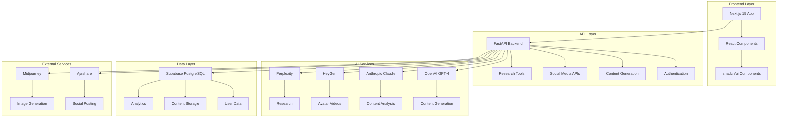

# 🏗️ System Architecture

## 📊 High-Level Overview

Sentigen Social is a modern, AI-powered social media platform built with a microservices architecture.



## 🎯 Core Components

### **Frontend (Next.js 15)**
- **Framework**: Next.js 15 with App Router
- **UI Library**: shadcn/ui + Tailwind CSS
- **State Management**: React hooks + Context
- **Authentication**: Supabase Auth
- **Deployment**: Vercel

### **Backend (FastAPI)**
- **Framework**: FastAPI with Pydantic AI
- **Architecture**: Microservices with workers
- **Authentication**: JWT + Supabase
- **Deployment**: Railway
- **Monitoring**: Structured logging

### **Database (Supabase)**
- **Engine**: PostgreSQL with extensions
- **Features**: Row Level Security, Real-time subscriptions
- **Backup**: Automated daily backups
- **Scaling**: Connection pooling ready

## 🔄 Data Flow

### **Content Creation Flow**
1. User creates content in dashboard
2. AI agents generate/optimize content
3. Content stored in database
4. Background workers process media
5. Content published to social platforms

### **Research Flow**
1. User configures research parameters
2. Research workers collect data
3. AI analyzes and extracts insights
4. Results stored and indexed
5. Insights available in dashboard

### **Video Generation Flow**
1. Research data triggers video creation
2. AI generates script from insights
3. HeyGen creates avatar video
4. Video processed and stored
5. Ready for social media posting

## 🛡️ Security Architecture

### **Authentication & Authorization**
- **Frontend**: Supabase Auth with JWT
- **Backend**: JWT validation + user context
- **Database**: Row Level Security (RLS)
- **API**: Rate limiting + CORS protection

### **Data Protection**
- **Encryption**: TLS 1.3 in transit
- **Storage**: Encrypted at rest (Supabase)
- **Secrets**: Environment variables only
- **Backup**: Encrypted automated backups

## ⚡ Performance Architecture

### **Caching Strategy**
- **Frontend**: Next.js static generation
- **Backend**: Redis caching layer
- **Database**: Query optimization + indexes
- **CDN**: Static asset delivery

### **Scaling Strategy**
- **Horizontal**: Load balancer ready
- **Database**: Read replicas + connection pooling
- **Workers**: Async task processing
- **Monitoring**: Real-time performance metrics

## 🔧 Development Architecture

### **Code Organization**
```
Sentigen-Social/
├── frontend/                # Next.js application
│   ├── src/app/            # App Router pages
│   ├── src/components/     # Reusable components
│   └── src/lib/            # Utilities and configs
├── social-media-module/    # Backend services
│   └── backend/
│       ├── api/            # FastAPI routes
│       ├── core/           # Core services
│       ├── workers/        # Background workers
│       └── database/       # Database layer
├── docs/                   # Documentation
└── database/               # Schema and migrations
```

### **Deployment Architecture**
- **Frontend**: Vercel (automatic deployments)
- **Backend**: Railway (containerized)
- **Database**: Supabase (managed PostgreSQL)
- **Monitoring**: Integrated error tracking

## 📈 Monitoring & Analytics

### **Application Monitoring**
- **Health Checks**: `/health` endpoint
- **Performance**: `/performance` metrics
- **Error Tracking**: Structured logging
- **Uptime**: Service availability monitoring

### **Business Analytics**
- **User Behavior**: Dashboard interactions
- **Content Performance**: Social media metrics
- **AI Usage**: Token consumption tracking
- **System Performance**: Response times

## 🔮 Future Architecture

### **Planned Enhancements**
- **Microservices**: Service mesh architecture
- **Event Streaming**: Real-time data processing
- **ML Pipeline**: Custom model training
- **Multi-tenant**: White-label architecture

### **Scalability Roadmap**
- **Global CDN**: Multi-region deployment
- **Database Sharding**: Horizontal partitioning
- **Kubernetes**: Container orchestration
- **Edge Computing**: Serverless functions

---

*This architecture supports current needs while being ready for future scale.*
